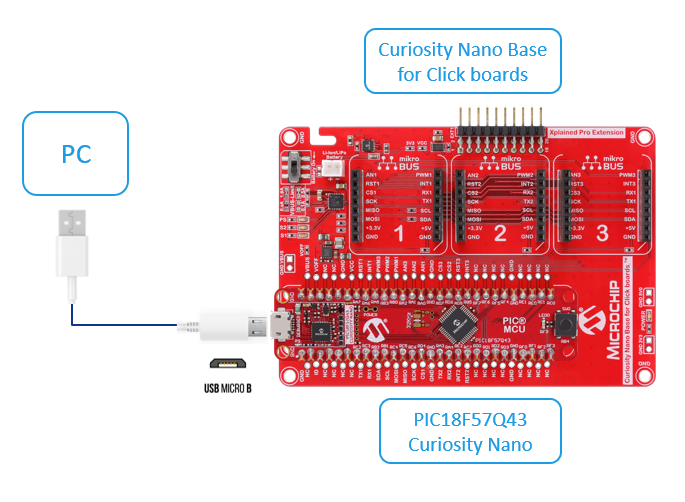
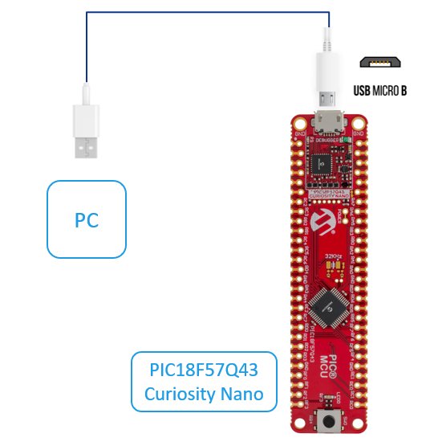

<!-- Please do not change this logo with link -->

[](https://www.microchip.com)

# Vectored Interrupt Demo for Microchip Univeristy Interrupt Class

<!-- This is where the introduction to the example goes, including mentioning the peripherals used -->

This code example showcases vectored interrupt functionality using three separate interrupt sources: Timer 0, Timer 1 and Interrupt-on-Change. Timer 1 is configured as a high-priority interrupt source. Timer 0 and Interrupt-on-Change are configured as low-priority interrupt sources. The results of this code example will be displayed in the MPLAB® Data Visualizer through the UART interface.

## Related Documentation

<!-- Any information about an application note or tech brief can be linked here. Use unbreakable links!
     In addition a link to the device family landing page and relevant peripheral pages as well:
     - [AN3381 - Brushless DC Fan Speed Control Using Temperature Input and Tachometer Feedback](https://microchip.com/00003381/)
     - [PIC18F-Q10 Family Product Page](https://www.microchip.com/design-centers/8-bit/pic-mcus/device-selection/pic18f-q10-product-family) -->

- [PIC18F57Q43 Curiosity Nano Hardware User Guide](https://ww1.microchip.com/downloads/en/DeviceDoc/PIC18F57Q43-Curiosity-Nano-HW-UserGuide-DS40002186B.pdf)
- [PIC18F57Q43 Data Sheet](https://ww1.microchip.com/downloads/en/DeviceDoc/PIC18F27-47-57Q43-Data-Sheet-40002147F.pdf)

## Software Used

<!-- All software used in this example must be listed here. Use unbreakable links!
     - MPLAB® X IDE 5.30 or newer [(microchip.com/mplab/mplab-x-ide)](http://www.microchip.com/mplab/mplab-x-ide)
     - MPLAB® XC8 2.10 or a newer compiler [(microchip.com/mplab/compilers)](http://www.microchip.com/mplab/compilers)
     - MPLAB® Code Configurator (MCC) 3.95.0 or newer [(microchip.com/mplab/mplab-code-configurator)](https://www.microchip.com/mplab/mplab-code-configurator)
     - MPLAB® Code Configurator (MCC) Device Libraries PIC10 / PIC12 / PIC16 / PIC18 MCUs [(microchip.com/mplab/mplab-code-configurator)](https://www.microchip.com/mplab/mplab-code-configurator)
     - Microchip PIC18F-Q Series Device Support (1.4.109) or newer [(packs.download.microchip.com/)](https://packs.download.microchip.com/) -->

- MPLAB® X IDE 6.00.0 or newer [(MPLAB® X IDE 6.00)](https://www.microchip.com/en-us/development-tools-tools-and-software/mplab-x-ide?utm_source=GitHub&utm_medium=TextLink&utm_campaign=MCU8_MMTCha_MPAE_Examples&utm_content=pic18f57q43-cnano-interrupt-mplab-mcc-github)
- MPLAB® XC8 2.35.0 or newer compiler [(MPLAB® XC8 2.35)](https://www.microchip.com/en-us/development-tools-tools-and-software/mplab-xc-compilers?utm_source=GitHub&utm_medium=TextLink&utm_campaign=MCU8_MMTCha_MPAE_Examples&utm_content=pic18f57q43-cnano-interrupt-mplab-mcc-github)
- MPLAB® Code Configurator (Plugin) v5.1.1 [(MPLAB® Code Configurator)](https://www.microchip.com/en-us/tools-resources/configure/mplab-code-configurator)
- MPLAB® Data Visualizer 1.3.1113 [(MPLAB® Data Visualizer)](<https://www.microchip.com/en-us/development-tools-tools-and-software/embedded-software-center/mplab-data-visualizer>)
- Microchip PIC18F-Q Series Device Support (1.13.211) or newer [(packs.download.microchip.com/)](https://packs.download.microchip.com/) 

## Hardware Used

<!-- All hardware used in this example must be listed here. Use unbreakable links!
     - PIC18F47Q10 Curiosity Nano [(DM182029)](https://www.microchip.com/Developmenttools/ProductDetails/DM182029)
     - Curiosity Nano Base for Click boards™ [(AC164162)](https://www.microchip.com/Developmenttools/ProductDetails/AC164162)
     - POT Click board™ [(MIKROE-3402)](https://www.mikroe.com/pot-click) -->

- PIC18F57Q43 Curiosity Nano [(DM164150)](https://www.microchip.com/en-us/development-tool/DM164150)
- Curiosity Nano Base for Click boards™ [(AC164162)](https://www.microchip.com/developmenttools/ProductDetails/AC164162)

## Setup

<!-- Explain how to connect hardware and set up software. Depending on complexity, step-by-step instructions and/or tables and/or images can be used -->

The PIC18F57Q43 Curiosity Nano Development Board is the selected hardware platform for this code example. The diagram below shows the hardware connections for this example.

Connection diagram if using Curiosity Nano Base for Click boards™:
<br>

Connection diagram without using Curiosity Nano Base for Click boards™:
<br>

## Project Configuration

The following section is the complete project configuration from [Project Creation](#project-creation) to [Interrupt Callback and Main Routine](#interrupt-callback-and-main-routine).
<br>If you do not want to go through the project configuration, you can refer to [Operation](#operation) to operate the demo.

### Project Creation

1. Click *Standalone Project*, then click *Next*
2. Enter "PIC18F57Q43" in Devices and select PIC18F57Q43 Curiosity Nano in Tool, then click *Next*
3. Click "XC8 with minimum version 2.35, then click *Next*
4. Enter "pic18f57q43-interrupt" as the project name and click *Finish* to finish the project creation
<br>

### Opening MCC

After creating the project, we need to open the MPLAB Code Configurator MCC to set system and peripheral configurations.
<br>This can be done by clicking the MCC icon on the Toolbar, or go to *Tools*,  *Embedded* and click *MPLAB® Code Configurator v5: Open/Close*.
<br>

### Clock Control Configuration

Choose *High Frequency Internal Oscillator* as the Clock Source, *1_MHz* in HF Internal Clock and *16* in Clock Divider.
<br>

### Peripheral Drivers Configuration

#### Timer 0 and Timer 1

To configure Timer 0, select *Timer 0* under Driver.

1. In Hardware Settings, disable Timer, select *1:8* in Clock Prescaler, select *1:1* in Postscaler, and select *16-bit* in Timer Mode. Select *LFINTOSC* as the Clock Source and enter "5" in the Requested Period.
2. In Interrupt Settings, enable *TMR Interrupt* option.

To configure Timer 1, select *Timer 1* under Driver.

1. In Timer Clock, select *LFINTOSC* as the Clock Source and select *1:8* in Prescaler.
2. In Timer Period, enter "5" in the Timer Period and you will see the Actual Period is 5.
3. In Interrupt Settings, enable *TMR Interrupt Enable* option.
<br>

#### UART Dependency Selector

To configure UART 1, select *UART* under Driver.

1. In UART PLIB Selector, select *UART1* .
2. In Builder window, click on *UART1 PLIB* and *UART1* to configure UART1 settings.
<br>

In UART1PLIB:

1. In Software Settings, enable *Redirect STDIO to UART* option.
2. In Hardware Settings, enable *Receive*, *Transmit* and *UART* options.
3. In Advanced Settings, select *high speed* in Baud Rate Generator Speed Select.

In UART:

1. Set the Requested Baudrate equal to the Calculated Baudrate, "7813". This will give the baud rate error about 0.006%, which is close to 0.
<br>

### Pin Manager & Pin Module Configuration

In Pin Grid View:

1. Unlock *T0CKI*, *T1CKI*, *T1G*, *CTS1* pins as these pins are not used for this demo.
2. Lock *PORTF1* with UART1 RX1 and *PORTF0* with UART 1 TX1.
3. Lock *PORTB4* with GPIO input.

In Pins:

1. Deselect *Analog*, *Slew Rate* and *Input Level Control* options for RF1 and RF0.
2. Deselect *Slew Rate* and *Input Level Control* options for RB4.
3. Enter "Switch" in Custom Name for RB4. Select "any" in Interrupt On Change to represent the interrupt is triggered by a positive or negative edge for RB4.
<br>

### Interrupt Manager Configuration

In Interrupt Manager,

1. Enable Vectored Interrupt, there will be two Interrupt Vector Tables representing high and low priorities.
2. Check the *Enable* and *High Priority* options for Timer 1 Interrupt.
3. Check the *Enable* option and uncheck the *High Priority* option for Interrupt On Change and Timer 0 Interrupt.
<br>

### Melody Code Generation

Click *Generate* to generate the corresponding Melody code.
<br>\

### Interrupt Callback and Main Routine

Once the code has been generated by Melody, add the following interrupt callback functions and main routine to the main.c file.

#### Timer1 Interrupt Callback

```C
void Timer1_Callback(void){
    for (int i=10; i>0; i--){
        INTERRUPT_GlobalInterruptHighDisable(); 
        INTERRUPT_GlobalInterruptLowDisable(); 
        printf("[High Priority] Timer1 ISR is executing ... Counting down: %d \r\n\n", i);
        INTERRUPT_GlobalInterruptHighEnable();
        INTERRUPT_GlobalInterruptLowEnable(); 
    }
    PIE3bits.TMR1IE = 0; // Disable Timer1
}
```

#### Timer0 Interrupt Callback

```C
void Timer0_Callback(void) {
    for (int i=10; i>0; i--){
        INTERRUPT_GlobalInterruptHighDisable(); 
        INTERRUPT_GlobalInterruptLowDisable(); 
        printf("[Low Priority] Timer0 ISR is executing ... Counting down: %d \r\n\n", i);
        INTERRUPT_GlobalInterruptHighEnable();
        INTERRUPT_GlobalInterruptLowEnable(); 
    }
    PIE3bits.TMR0IE = 0; // Disable Timer0
}
```

#### RB4 IOC Callback

```C
void RB4_IOC_Callback(void){
    for (int i=10; i>0; i--){
        INTERRUPT_GlobalInterruptHighDisable(); 
        INTERRUPT_GlobalInterruptLowDisable(); 
        printf("[Low Priority] IOC ISR is executing ... Counting down: %d \r\n\n", i);
        INTERRUPT_GlobalInterruptHighEnable();
        INTERRUPT_GlobalInterruptLowEnable(); 
    }
    PIE0bits.IOCIE = 0; // Disable RB4 IOC
}
```

#### Main Routine

```C
int main(void)
{
    SYSTEM_Initialize();

    // If using interrupts in PIC18 High/Low Priority Mode you need to enable the Global High and Low Interrupts 
    // If using interrupts in PIC Mid-Range Compatibility Mode you need to enable the Global Interrupts 
    // Use the following macros to: 

    // Enable the Global High Interrupts 
    INTERRUPT_GlobalInterruptHighEnable(); 

    // Disable the Global High Interrupts 
    //INTERRUPT_GlobalInterruptHighDisable(); 

    // Enable the Global Low Interrupts 
    INTERRUPT_GlobalInterruptLowEnable(); 

    // Disable the Global Low Interrupts 
    //INTERRUPT_GlobalInterruptLowDisable(); 

    bool done = false;  
   
    Timer0_OverflowCallbackRegister (Timer0_Callback);
    Timer1_OverflowCallbackRegister (Timer1_Callback);
    RB4_SetInterruptHandler (RB4_IOC_Callback);

    printf("---------------------------------------------------------------------------\r\n\n");
    printf("   Demo 1: High/Low-Priority Interrupt While Executing Main Routine        \r\n\n");
    printf("   Demo 2: High-Priority Interrupt with a Low-Priority Interrupt Pending   \r\n\n");
    printf("   Demo 3: High-Priority Interrupt Preempting Low-Priority Interrupts      \r\n\n");
    printf("   Demo 4: Simultaneous High- and Low-Priority Interrupts                  \r\n\n");
    printf("                   Please enter a number: (1/2/3/4)                        \r\n\n");
    while(!done) {
        done = true;
        UART1_Enable();
        

        while(!(UART1_IsRxReady()));
        switch(UART1_Read()){   
            case 49: //Decimal 1 = ASCII 49
                        // Demo 1: High/Low-Priority Interrupt While Executing Main Routine
                        printf("-------------------------------------------------------------------------\r\n\n");
                        printf("Entering Demo 1: High/Low-Priority Interrupt While Executing Main Routine\r\n\n");
                        printf("-------------------------------------------------------------------------\r\n\n");
                        break;
                    case 50: //Decimal 2 = ASCII 50
                        // Demo 2: High-Priority Interrupt with a Low-Priority Interrupt Pending
                        printf("------------------------------------------------------------------------------\r\n\n");
                        printf("Entering Demo 2: High-Priority Interrupt with a Low-Priority Interrupt Pending\r\n\n");
                        printf("------------------------------------------------------------------------------\r\n\n");
                        Timer1_Start();
                        break;
                    case 51: //Decimal 3 = ASCII 51
                        // Demo 3: High-Priority Interrupt Preempting Low-Priority Interrupts
                        printf("---------------------------------------------------------------------------\r\n\n");
                        printf("Entering Demo 3: High-Priority Interrupt Preempting Low-Priority Interrupts\r\n\n");
                        printf("---------------------------------------------------------------------------\r\n\n");
                        Timer1_Start();
                        break;
                    case 52: //Decimal 4 = ASCII 52
                        // Demo 4: Simultaneous High- and Low-Priority Interrupts
                        printf("---------------------------------------------------------------\r\n\n");
                        printf("Entering Demo 4: Simultaneous High- and Low-Priority Interrupts\r\n\n");
                        printf("---------------------------------------------------------------\r\n\n");
                        Timer1_Start();
                        Timer0_Start();
                        break;
                    default:
                        printf("Please enter a valid number!!! (1/2/3/4) \r\n\n");
                        UART1_Disable(); // FIFO Reset
                        done = false;
                        break;
        }
    }
    
    for (int i=10; i>0; i--){
        INTERRUPT_GlobalInterruptHighDisable(); 
        INTERRUPT_GlobalInterruptLowDisable(); 
        printf("        Main routine is executing ... Counting down: %d \r\n\n", i);
        INTERRUPT_GlobalInterruptHighEnable();
        INTERRUPT_GlobalInterruptLowEnable(); 
    }
    
    printf("-----------\r\n\n");
    printf("End of Demo\r\n\n");
    printf("-----------\r\n\n");

    while(1)
    {
    }    
}
```

## Operation

<!-- Explain how to operate the example. Depending on complexity, step-by-step instructions and/or tables and/or images can be used -->

1. Insert the PIC18F57Q43 Curiosity Nano into the Curiosity Nano Base board(if Curiosity Nano Base board is used).

2. Connect the PIC18F57Q43 Curiosity Nano development board to a PC using a micro USB cable to provide power and to allow for programming and debugging.
<br> 

3. Open the *pic18f57q43-interrupt.X* project in MPLAB® X IDE.

4. Set *pic18f57q43-interrupt.X* project as the main project within the MPLAB® X IDE. This can be done by right clicking on the project name in the *Projects* tab and then clicking *Set as Main Project*:
<br>

5. Select the PIC18F57Q43 Curiosity Nano in the project settings within the MPLAB® X IDE. This can be done using the following steps:

- Right click on the project and select *Properties*;
<br>

- Select the PIC18F57Q43 Curiosity Nano in the *Connected Hardware Tool* and click *OK*:
<br>

### Project Building

Click the *Clean and Build Main Project* icon in the toolbar.
<br>The "BUILD SUCCESSFUL" message in the Output window means no error comes up during compilation.
<br>

### Device Programming

Click the *Make and Program Device Main Project* in the toolbar.
<br>The "Programming complete" message in the Output window means the firmware has been successfully downloaded to the Curiosity Nano board.
<br>

<br>Once the device has been successfully programmed, open the MPLAB® Data Visualizer within the MPLAB® X IDE.
<br>

- Once the MPLAB® Data Visualizer has launched, open the drop down list and select the COMn port for serial connection and Click the *Start streaming COMn port* button.
<br>

- In the MPLAB® Data Visualizer terminal window, click COMn port as the source.
<br>

8. Enter the number "1", "2", "3", or "4" into the MPLAB® Data Visualizer terminal to launch the respective demo on the PIC18F57Q43 Curiosity Nano Development Board. Details pertaining to each of the available demos are shown in the figures below:

[Demo 1: High/Low-Priority Interrupt While Executing Main Routine](#demo-1)
<br>

[Demo 2: High-Priority Interrupt with a Low-Priority Interrupt Pending](#demo-2)
<br>

[Demo 3: High-Priority Interrupt Preempting Low-Priority Interrupts](#demo-3)
<br>

[Demo 4: Simultaneous High- and Low-Priority Interrupts](#demo-4)
<br>

### Result

The figures below show the resulting terminal outputs for each of the available demos:

#### Demo 1

<br>

#### Demo 2

<br>

#### Demo 3

<br>

#### Demo 4

<br>

## Summary

<!-- Summarize what the example has shown -->

This code example showcases the vectored interrupt feature of the PIC18F57Q43.
This demo is for the Microchip University 8-bit PIC® MCU Peripheral Deep Dive Interrupt class.
