<!-- Please do not change this logo with link -->

[](https://www.microchip.com)

# Vectored Interrupt Demo for Microchip Univeristy Interrupt Class

<!-- This is where the introduction to the example goes, including mentioning the peripherals used -->

This code example showcases vectored interrupt functionality using three separate interrupt sources: Timer 0, Timer 1 and Interrupt-on-Change. Timer 1 is configured as a high-priority interrupt source. Timer 0 and Interrupt-on-Change are configured as low-priority interrupt sources. The results of this code example will be displayed in the MPLAB® Data Visualizer through the UART interface.

## Related Documentation

<!-- Any information about an application note or tech brief can be linked here. Use unbreakable links!
     In addition a link to the device family landing page and relevant peripheral pages as well:
     - [AN3381 - Brushless DC Fan Speed Control Using Temperature Input and Tachometer Feedback](https://microchip.com/00003381/)
     - [PIC18F-Q10 Family Product Page](https://www.microchip.com/design-centers/8-bit/pic-mcus/device-selection/pic18f-q10-product-family) -->

- [PIC18F57Q43 Curiosity Nano Hardware User Guide](https://ww1.microchip.com/downloads/en/DeviceDoc/PIC18F57Q43-Curiosity-Nano-HW-UserGuide-DS40002186B.pdf)
- [PIC18F57Q43 Data Sheet](https://ww1.microchip.com/downloads/en/DeviceDoc/PIC18F27-47-57Q43-Data-Sheet-40002147F.pdf)

## Software Used

<!-- All software used in this example must be listed here. Use unbreakable links!
     - MPLAB® X IDE 5.30 or newer [(microchip.com/mplab/mplab-x-ide)](http://www.microchip.com/mplab/mplab-x-ide)
     - MPLAB® XC8 2.10 or a newer compiler [(microchip.com/mplab/compilers)](http://www.microchip.com/mplab/compilers)
     - MPLAB® Code Configurator (MCC) 3.95.0 or newer [(microchip.com/mplab/mplab-code-configurator)](https://www.microchip.com/mplab/mplab-code-configurator)
     - MPLAB® Code Configurator (MCC) Device Libraries PIC10 / PIC12 / PIC16 / PIC18 MCUs [(microchip.com/mplab/mplab-code-configurator)](https://www.microchip.com/mplab/mplab-code-configurator)
     - Microchip PIC18F-Q Series Device Support (1.4.109) or newer [(packs.download.microchip.com/)](https://packs.download.microchip.com/) -->

- MPLAB® X IDE 6.00.0 or newer [(MPLAB® X IDE 6.00)](https://www.microchip.com/en-us/development-tools-tools-and-software/mplab-x-ide?utm_source=GitHub&utm_medium=TextLink&utm_campaign=MCU8_MMTCha_MPAE_Examples&utm_content=pic18f57q43-cnano-interrupt-mplab-mcc-github)
- MPLAB® XC8 2.35.0 or newer compiler [(MPLAB® XC8 2.35)](https://www.microchip.com/en-us/development-tools-tools-and-software/mplab-xc-compilers?utm_source=GitHub&utm_medium=TextLink&utm_campaign=MCU8_MMTCha_MPAE_Examples&utm_content=pic18f57q43-cnano-interrupt-mplab-mcc-github)
- MPLAB® Code Configurator (Plugin) v5.1.1 [(MPLAB® Code Configurator)](https://www.microchip.com/en-us/tools-resources/configure/mplab-code-configurator)
- MPLAB® Data Visualizer 1.3.1113 [(MPLAB® Data Visualizer)](<https://www.microchip.com/en-us/development-tools-tools-and-software/embedded-software-center/mplab-data-visualizer>)
- Microchip PIC18F-Q Series Device Support (1.13.211) or newer [(packs.download.microchip.com/)](https://packs.download.microchip.com/) 

## Hardware Used

<!-- All hardware used in this example must be listed here. Use unbreakable links!
     - PIC18F47Q10 Curiosity Nano [(DM182029)](https://www.microchip.com/Developmenttools/ProductDetails/DM182029)
     - Curiosity Nano Base for Click boards™ [(AC164162)](https://www.microchip.com/Developmenttools/ProductDetails/AC164162)
     - POT Click board™ [(MIKROE-3402)](https://www.mikroe.com/pot-click) -->

- PIC18F57Q43 Curiosity Nano [(DM164150)](https://www.microchip.com/en-us/development-tool/DM164150)
- Curiosity Nano Base for Click boards™ [(AC164162)](https://www.microchip.com/developmenttools/ProductDetails/AC164162)

## Setup

<!-- Explain how to connect hardware and set up software. Depending on complexity, step-by-step instructions and/or tables and/or images can be used -->

The PIC18F57Q43 Curiosity Nano Development Board is the selected hardware platform for this code example. The diagram below shows the hardware connections for this example.

Connection diagram if using Curiosity Nano Base for Click boards™:
<br>

Connection diagram without using Curiosity Nano Base for Click boards™:
<br>

## Project Configuration

The following section gives a step by step tutorial of the complete project configuration for this code example.

### Project Creation <a name="project-creation"></a>

1. To create a new project go to "File >> New Project". Once the new project window opens, select *Standalone Project* and then click *Next*.
<br>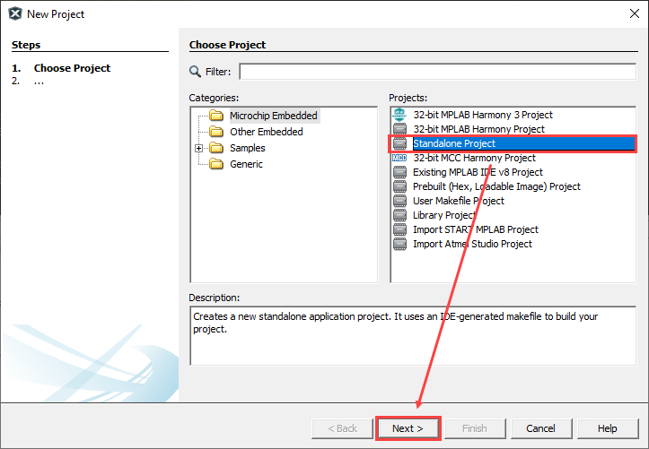
2. Enter "PIC18F57Q43" as the device and select PIC18F57Q43 Curiosity Nano as the Tool for this project. Once this is complete click *Next*.
<br>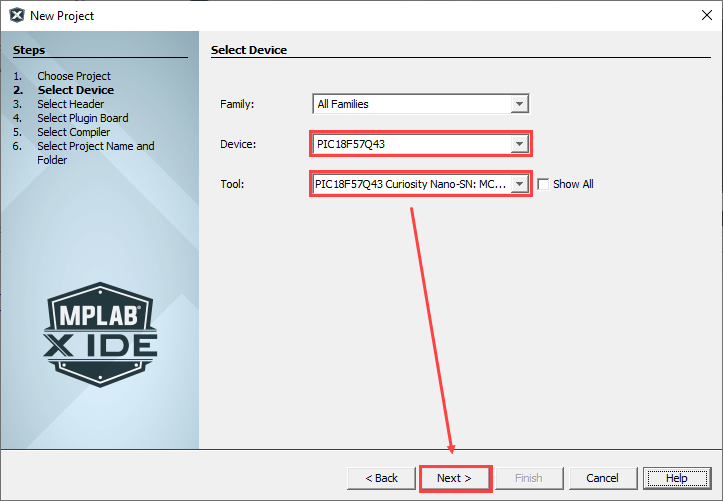
3. For the compiler, select "XC8 version 2.35 (or newer) and then click *Next*.
<br>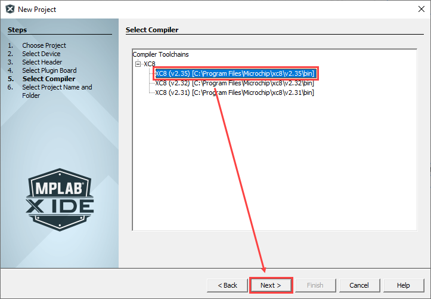
4. Enter "pic18f57q43-interrupt" as the project name and click *Finish* to finish the project creation.
<br>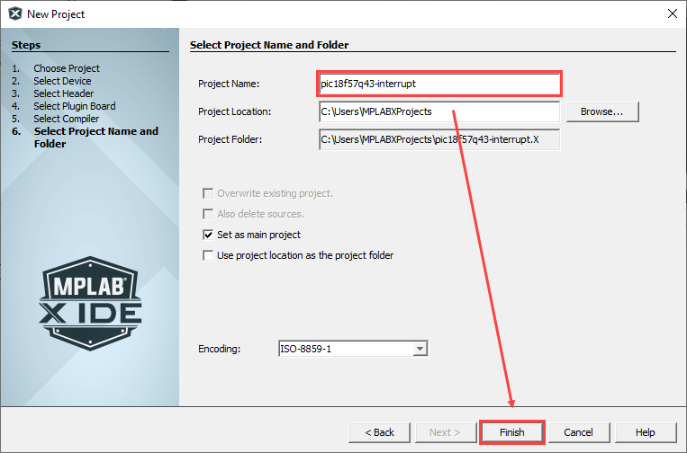

### Opening MCC

After creating the project, the next step is to open the MPLAB Code Configurator (MCC) to set  the system and peripheral configurations.
This can be done by clicking the MCC icon on the Toolbar, or by going to "*Tools* >> *Embedded* and clicking *MPLAB® Code Configurator: Open/Close*.
<br>

### Clock Control Configuration

In the Clock Control configuration window which can be found under the System Settings drop down in MCC:
<br>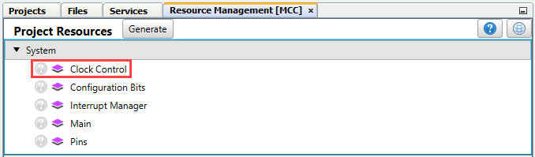

To configure the device system clock, select the *High Frequency Internal Oscillator* as the Clock Source, as well as the *1_MHz* option for the HF Internal Clock drop down menu and *16* in the Clock Divider drop down menu.
<br>

### Peripheral Drivers Configuration

#### Timer 0

Add Timer 0 to the MPLABX project by selecting *Timer 0* from the Driver drop down menu in MCC.
<br>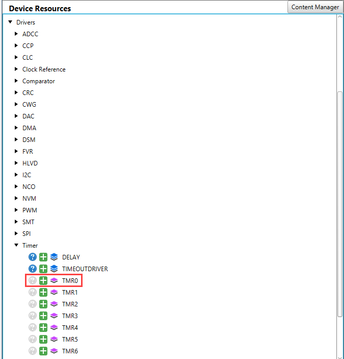

1. In the Timer 0 Hardware Settings, make sure the timer is disabled by unchecking the "Enable Timer" box. Select *1:8* as the Clock Prescaler, select *1:1* as the Postscaler, and select *16-bit* as the Timer Mode. Additionally, select *LFINTOSC* as the Clock Source and enter "5" seconds as the Requested Period.
2. In the Timer 0 Interrupt Settings, check the *TMR Interrupt Enable* check box to enable interrupts for this peripheral.
<br>

#### Timer 1

Add Timer 1 to the MPLABX project by selecting *Timer 1* from the Driver drop down menu in MCC.
<br>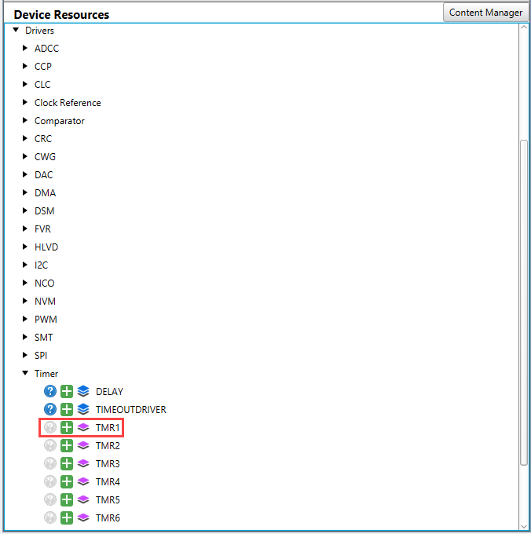

1. In the MCC Easy View configuration window select *LFINTOSC* as the Timer 1 Clock Source and select *1:8* as the Prescaler.
2. In the Timer Period field enter "5" and the "Actual Period" field should show that the Timer 1 period is 5 seconds.
In the Timer 1 Interrupt Settings, check the *TMR Interrupt Enable* check box to enable interrupts for this peripheral.
<br>

#### UART 1

To configure UART 1, add the UART module to the project by selecting *UART* from the Driver drop down menu in MCC.
<br>

1. After doing this, in the "UART PLIB Selector" drop down menu that shows up, select *UART1* from the available options.
<br>
2. In the "Builder Window", click on *UART1 PLIB* and *UART1* to configure the different UART1 settings.
<br>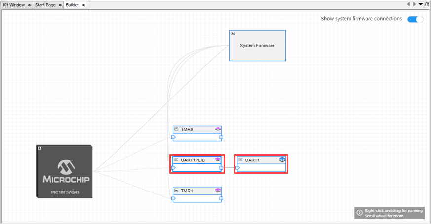

In the "UART1PLIB" configuration window:

1. In Software Settings, enable *Redirect STDIO to UART* option.
2. In Hardware Settings, enable *Receive*, *Transmit* and *UART* options by checking the respective boxes.
3. In Advanced Settings, select *high speed* in Baud Rate Generator Speed Select.
<br>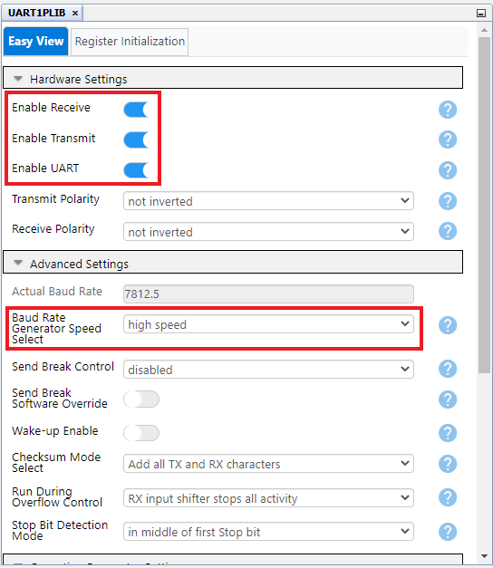

In the "UART1" configuration window:

1. Set the Requested Baudrate equal to the Calculated Baudrate, "7813". This will give the baud rate error about 0.006%, which is close to 0.
<br>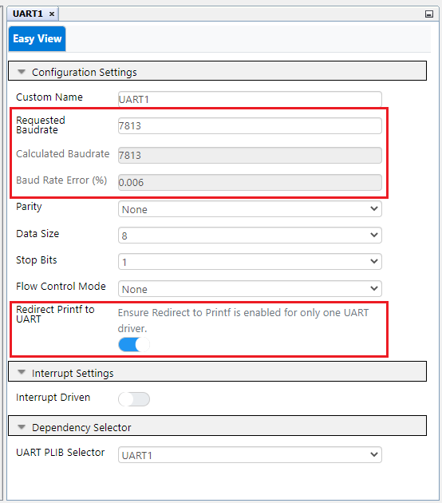

### Pins Configuration

To configure the pins for this project, open the "Pin Grid View" window:

1. Deselect the *T0CKI*, *T1CKI*, *T1G* and *CTS1* pins as these pins are not used for this demo. This can be done by clicking on each pin so that the closed lock changes to an open lock.
2. Configure the UART1 RX1 pin on RF1 and the UART1 TX1 pin on RF0 by clicking the corresponding options in the Pin Grid View. The pins should change from open locks to closed locks.
3. Configure RB4 as a GPIO input pin by clicking the corresponding lock box in the Pin Grid View. The pin should change from an open lock to a closed lock.
<br>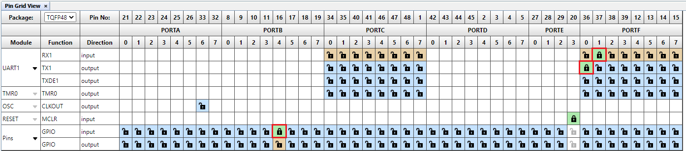

To configure the pins for this project, using the the "Pins" window which can be found under the system settings drop down menu in MCC:
<br>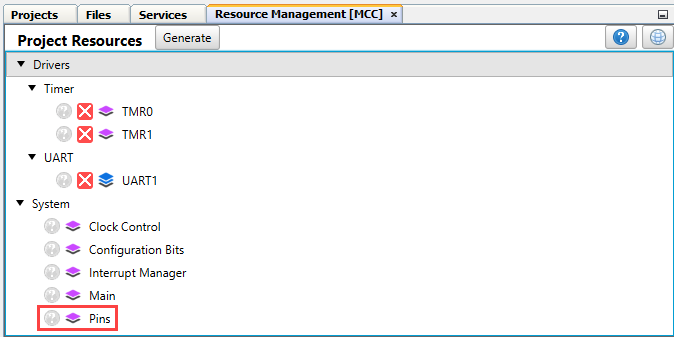

1. Deselect the *Analog*, *Slew Rate* and *Input Level Control* options for pins RF1 and RF0.
2. Deselect the *Slew Rate* and *Input Level Control* options for pin RB4.
3. Enter "Switch" as a Custom Name for pin RB4. Select "any" in the "Interrupt On Change" drop down menu. This makes it so that an interrupt is triggered by a positive or negative edge on pin RB4.
<br>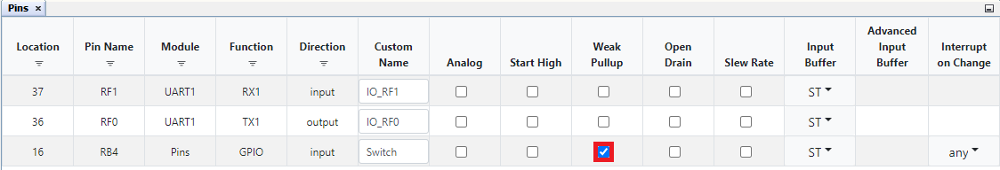

### Interrupt Manager Configuration

In the Interrupt Manager configuration window which can be found under the System Settings drop down in MCC:
<br>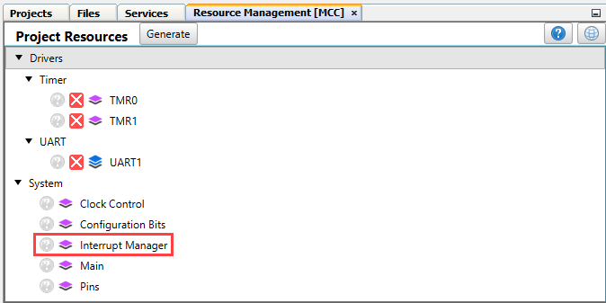

1. Enable Vectored Interrupts by checking the corresponding box. There will be two Interrupt Vector Tables that represent high and low priority interrupt vectors.
2. Check the *Enable* and *High Priority* options for Timer 1 Interrupt vector.
3. Check the *Enable* option and uncheck the *High Priority* option for "Interrupt On Change" and "Timer 0" Interrupt vectors.
<br>

### Melody Code Generation

Click the *Generate* button in MCC to generate the corresponding Melody code.
<br>\

### Interrupt Callback and Main Routine <a name="interrupt-callback-and-main-routine"></a>

Once the code has been generated by Melody, add the following interrupt callback functions and main routine into the main.c file.

#### Timer1 Interrupt Callback

```C
void Timer1_Callback(void){
    for (int i=10; i>0; i--){
        INTERRUPT_GlobalInterruptHighDisable(); 
        INTERRUPT_GlobalInterruptLowDisable(); 
        printf("[High Priority] Timer1 ISR is executing ... Counting down: %d \r\n\n", i);
        INTERRUPT_GlobalInterruptHighEnable();
        INTERRUPT_GlobalInterruptLowEnable(); 
    }
    PIE3bits.TMR1IE = 0; // Disable Timer1
}
```

#### Timer0 Interrupt Callback

```C
void Timer0_Callback(void) {
    for (int i=10; i>0; i--){
        INTERRUPT_GlobalInterruptHighDisable(); 
        INTERRUPT_GlobalInterruptLowDisable(); 
        printf("[Low Priority] Timer0 ISR is executing ... Counting down: %d \r\n\n", i);
        INTERRUPT_GlobalInterruptHighEnable();
        INTERRUPT_GlobalInterruptLowEnable(); 
    }
    PIE3bits.TMR0IE = 0; // Disable Timer0
}
```

#### RB4 IOC Callback

```C
void RB4_IOC_Callback(void){
    for (int i=10; i>0; i--){
        INTERRUPT_GlobalInterruptHighDisable(); 
        INTERRUPT_GlobalInterruptLowDisable(); 
        printf("[Low Priority] IOC ISR is executing ... Counting down: %d \r\n\n", i);
        INTERRUPT_GlobalInterruptHighEnable();
        INTERRUPT_GlobalInterruptLowEnable(); 
    }
    PIE0bits.IOCIE = 0; // Disable RB4 IOC
}
```

#### Main Routine

```C
int main(void)
{
    SYSTEM_Initialize();

    // If using interrupts in PIC18 High/Low Priority Mode you need to enable the Global High and Low Interrupts 
    // If using interrupts in PIC Mid-Range Compatibility Mode you need to enable the Global Interrupts 
    // Use the following macros to: 

    // Enable the Global High Interrupts 
    INTERRUPT_GlobalInterruptHighEnable(); 

    // Disable the Global High Interrupts 
    //INTERRUPT_GlobalInterruptHighDisable(); 

    // Enable the Global Low Interrupts 
    INTERRUPT_GlobalInterruptLowEnable(); 

    // Disable the Global Low Interrupts 
    //INTERRUPT_GlobalInterruptLowDisable(); 

    bool done = false;  
   
    Timer0_OverflowCallbackRegister (Timer0_Callback);
    Timer1_OverflowCallbackRegister (Timer1_Callback);
    RB4_SetInterruptHandler (RB4_IOC_Callback);

    printf("---------------------------------------------------------------------------\r\n\n");
    printf("   Demo 1: High/Low-Priority Interrupt While Executing Main Routine        \r\n\n");
    printf("   Demo 2: High-Priority Interrupt with a Low-Priority Interrupt Pending   \r\n\n");
    printf("   Demo 3: High-Priority Interrupt Preempting Low-Priority Interrupts      \r\n\n");
    printf("   Demo 4: Simultaneous High- and Low-Priority Interrupts                  \r\n\n");
    printf("                   Please enter a number: (1/2/3/4)                        \r\n\n");
    while(!done) {
        done = true;
        UART1_Enable();
        

        while(!(UART1_IsRxReady()));
        switch(UART1_Read()){   
            case 49: //Decimal 1 = ASCII 49
                        // Demo 1: High/Low-Priority Interrupt While Executing Main Routine
                        printf("-------------------------------------------------------------------------\r\n\n");
                        printf("Entering Demo 1: High/Low-Priority Interrupt While Executing Main Routine\r\n\n");
                        printf("-------------------------------------------------------------------------\r\n\n");
                        break;
                    case 50: //Decimal 2 = ASCII 50
                        // Demo 2: High-Priority Interrupt with a Low-Priority Interrupt Pending
                        printf("------------------------------------------------------------------------------\r\n\n");
                        printf("Entering Demo 2: High-Priority Interrupt with a Low-Priority Interrupt Pending\r\n\n");
                        printf("------------------------------------------------------------------------------\r\n\n");
                        Timer1_Start();
                        break;
                    case 51: //Decimal 3 = ASCII 51
                        // Demo 3: High-Priority Interrupt Preempting Low-Priority Interrupts
                        printf("---------------------------------------------------------------------------\r\n\n");
                        printf("Entering Demo 3: High-Priority Interrupt Preempting Low-Priority Interrupts\r\n\n");
                        printf("---------------------------------------------------------------------------\r\n\n");
                        Timer1_Start();
                        break;
                    case 52: //Decimal 4 = ASCII 52
                        // Demo 4: Simultaneous High- and Low-Priority Interrupts
                        printf("---------------------------------------------------------------\r\n\n");
                        printf("Entering Demo 4: Simultaneous High- and Low-Priority Interrupts\r\n\n");
                        printf("---------------------------------------------------------------\r\n\n");
                        Timer1_Start();
                        Timer0_Start();
                        break;
                    default:
                        printf("Please enter a valid number!!! (1/2/3/4) \r\n\n");
                        UART1_Disable(); // FIFO Reset
                        done = false;
                        break;
        }
    }
    
    for (int i=10; i>0; i--){
        INTERRUPT_GlobalInterruptHighDisable(); 
        INTERRUPT_GlobalInterruptLowDisable(); 
        printf("        Main routine is executing ... Counting down: %d \r\n\n", i);
        INTERRUPT_GlobalInterruptHighEnable();
        INTERRUPT_GlobalInterruptLowEnable(); 
    }
    
    printf("-----------\r\n\n");
    printf("End of Demo\r\n\n");
    printf("-----------\r\n\n");

    while(1)
    {
    }    
}
```

## Operation <a name="operation"></a>

<!-- Explain how to operate the example. Depending on complexity, step-by-step instructions and/or tables and/or images can be used -->

1. Insert the PIC18F57Q43 Curiosity Nano into the Curiosity Nano Base board(if Curiosity Nano Base board is used).

2. Connect the PIC18F57Q43 Curiosity Nano development board to a PC using a micro USB cable to provide power and to allow for programming and debugging.
<br> 


3. Open the *pic18f57q43-interrupt.X* project in MPLAB® X IDE.

4. Set *pic18f57q43-interrupt.X* project as the main project within the MPLAB® X IDE. This can be done by right clicking on the project name in the *Projects* tab and then clicking *Set as Main Project*.
<br>


5. Select the PIC18F57Q43 Curiosity Nano in the project settings within the MPLAB® X IDE. This can be done using the following steps.

- Right click on the project and select *Properties*.
<br>


- Select the PIC18F57Q43 Curiosity Nano in the *Connected Hardware Tool* and click *OK*.
<br>

### Project Building

Click the *Clean and Build Main Project* icon in the toolbar.
The "BUILD SUCCESSFUL" message in the Output window means no error comes up during compilation.
<br>

### Device Programming

Click the *Make and Program Device Main Project* in the toolbar.
<br>The "Programming complete" message in the Output window means the firmware has been successfully downloaded to the Curiosity Nano board.
<br>

<br>Once the device has been successfully programmed, open the MPLAB® Data Visualizer within the MPLAB® X IDE.
<br>

- Once the MPLAB® Data Visualizer has launched, open the drop down list and select the COMn port for serial connection and Click the *Start streaming COMn port* button.
<br>

- In the MPLAB® Data Visualizer terminal window, click COMn port as the source.
<br>

8. Enter the number "1", "2", "3", or "4" into the MPLAB® Data Visualizer terminal to launch the respective demo on the PIC18F57Q43 Curiosity Nano Development Board. Details pertaining to each of the available demos are shown in the figures below:

[Demo 1: High/Low-Priority Interrupt While Executing Main Routine](#demo-1)
<br>

[Demo 2: High-Priority Interrupt with a Low-Priority Interrupt Pending](#demo-2)
<br>

[Demo 3: High-Priority Interrupt Preempting Low-Priority Interrupts](#demo-3)
<br>

[Demo 4: Simultaneous High- and Low-Priority Interrupts](#demo-4)
<br>

### Result

The figures below show the resulting terminal outputs for each of the available demos:

#### Demo 1 <a name="demo-1"></a>

<br>

#### Demo 2 <a name="demo-2"></a>

<br>

#### Demo 3 <a name="demo-3"></a>

<br>

#### Demo 4 <a name="demo-4"></a>

<br>

## Summary

<!-- Summarize what the example has shown -->

This code example showcases the vectored interrupt feature of the PIC18F57Q43.
This demo is for the Microchip University 8-bit PIC® MCU Peripheral Deep Dive Interrupt class.
